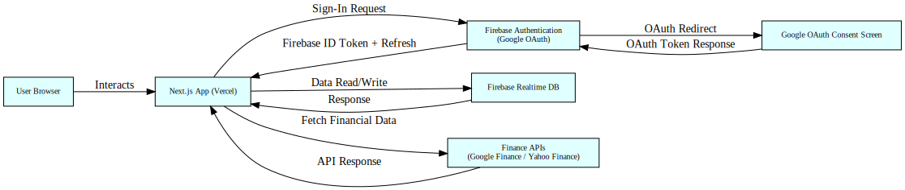

# Tech Demo

A modern, responsive web application for financial data visualization and analysis, built with **Next.js**, **React**, **MUI**, **PrimeReact**, and **Firebase**. This project integrates real-time stock market data, provides authentication, and demonstrates scalable UI patterns.

---

## 🚀 Features

- 🔐 **Authentication** with Firebase (client-side and admin)
- 📈 **Financial Data Visualization** using Google Finance API, Yahoo Finance API, and Recharts
- 🧠 **Data Fetching** with SWR and Axios (stale-while-revalidate caching)
- 🎨 **UI Frameworks:**  
  Material UI (MUI) + Emotion, PrimeReact + PrimeFlex, Sass
- ⚙️ **Server-side Rendering (SSR)** and static generation with Next.js
- 🔔 **UI Enhancements:** Toast notifications, modals, and confirmations (React ecosystem)
- 🌐 **Timezone-aware datetime formatting** with Moment.js and React-Moment

---

## 📦 Tech Stack

| **Category**        | **Tech**                                             |
|---------------------|------------------------------------------------------|
| **Frontend**        | Next.js (React 18)                                   |
| **Styling**         | MUI, Emotion, Sass                                   |
| **State & Data**    | SWR, Axios                                           |
| **Authentication**  | Firebase (client & admin)                            |
| **APIs**            | Google Finance, Yahoo Finance                        |
| **Visualization**   | Recharts                                             |
| **Tooling**         | TypeScript, ESLint, Prettier, env-cmd                |
| **Database**        | Firebase Realtime DB (NoSQL)                         |
| **Hosting**         | Vercel                                               |
| **CI/CD**           | GitHub Actions / Git Workflows                       |

